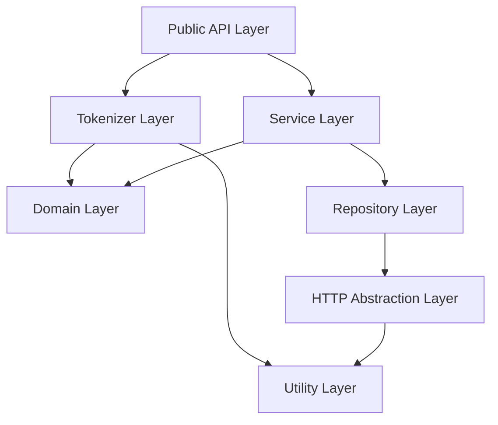

# Architecture

This document describes the layered structure of the core library.

## Layers

- **Public API layer**: `core/src/parser.rs`, `core/src/experimental/parser.rs`
- **Tokenizer layer**: `core/src/tokenizer/`
- **Service layer**: `core/src/interactor/`
- **Repository layer**: `core/src/repository/`
- **HTTP abstraction layer**: `core/src/http/`
- **Domain layer**: `core/src/domain/`
- **Utility layer**: `core/src/formatter/`, `core/src/adapter/`, `core/src/util/`

## Note
The `ApiClient` trait abstraction (defined in `core/src/http/`) enables pluggable HTTP clients for flexibility in different environments (e.g., `ReqwestApiClient` for server/WASM, potentially mock clients for testing).
