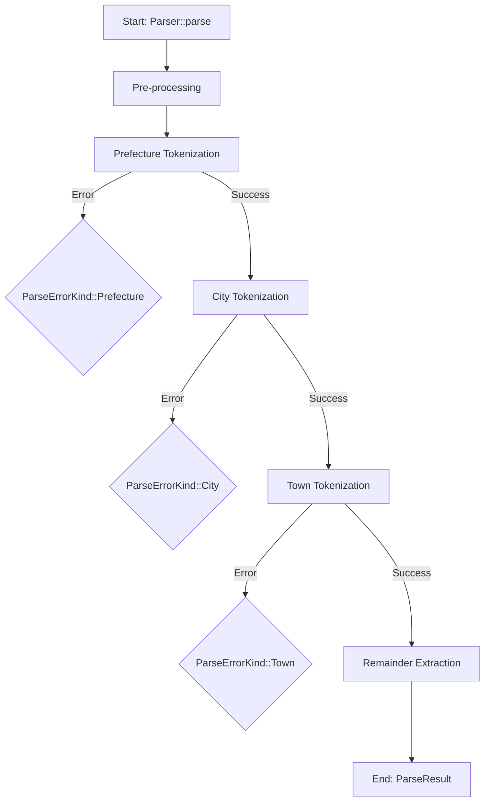

# Parsing Pipeline

This document describes the entire parsing process from `Parser::parse()` to `ParseResult`.

## Source File References

- `Parser::parse`: `core/src/parser.rs`
- Pre-processing (optional; Unicode normalization, whitespace handling): `core/src/parser.rs`
- Prefecture Tokenization (JIS X 0401 matching): `core/src/tokenizer/read_prefecture.rs`
- City Tokenization (exact match → variant match → county completion): `core/src/tokenizer/read_city.rs`
- Town Tokenization (6-pass formatter cascade): `core/src/tokenizer/read_town.rs`
- Remainder Extraction: `core/src/parser.rs`
