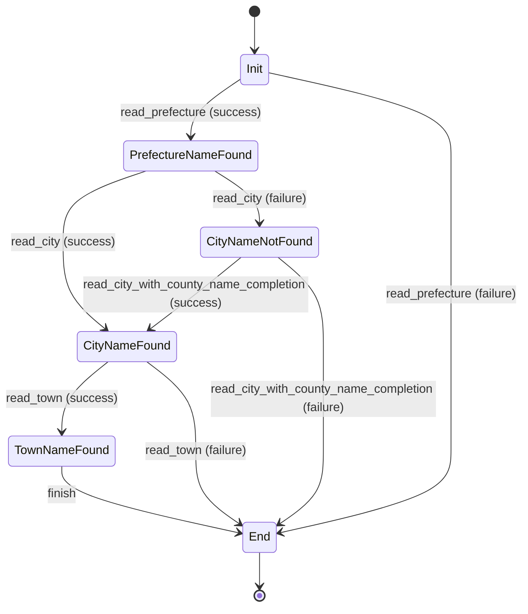

# Tokenizer State Machine

This document describes the tokenizer state machine used in `japanese-address-parser`.



## State Data
Each state is represented by a `Tokenizer<State>` struct:

```rust
pub struct Tokenizer<State> {
    pub(crate) tokens: Vec<Token>,
    rest: String,
    _state: PhantomData<State>,
}
```

- `tokens`: A collection of identified tokens (Prefecture, City, Town, Rest).
- `rest`: The remaining unparsed address string.
- `_state`: A `PhantomData` marker for the current state, providing compile-time type safety.

## Compile-Time Guarantees
The use of the phantom type pattern (`PhantomData<State>`) ensures that tokenizer methods can only be called in the correct sequence. For example, `read_town` is only implemented for `Tokenizer<CityNameFound>`, preventing attempts to read a town name before a city name has been found.

## References
- Tokenizer definition and states: `core/src/tokenizer.rs`
- Prefecture tokenization: `core/src/tokenizer/read_prefecture.rs`
- City tokenization: `core/src/tokenizer/read_city.rs`, `core/src/tokenizer/read_city_with_county_name_completion.rs`
- Town tokenization: `core/src/tokenizer/read_town.rs`
