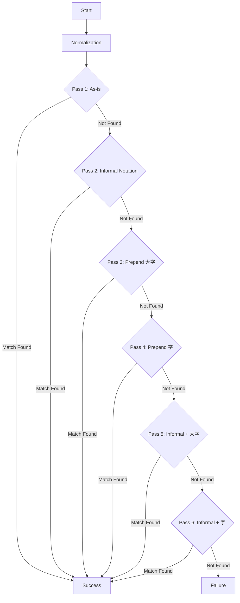

# Town Matching Algorithm

This document describes the 6-pass town name matching algorithm implemented in the tokenizer.

## Pre-matching Normalization
Before the 6-pass cascade, the following normalizations are applied:
1. Fullwidth to halfwidth conversion (for numerals).
2. Arabic chōme (e.g., `1丁目`) conversion if `丁目` exists in the string.

## 6-Pass Matching Cascade

## Prioritization Logic
The `find_town` function performs the actual candidate matching. To improve accuracy:
1. Candidates containing `丁目` (indicating a municipality with house numbering) are prioritized and checked first.
2. `OrthographicalVariantAdapter` is applied at each candidate check to handle common variations (e.g., `ッ` vs `ツ`).

## References
- Town matching implementation: `core/src/tokenizer/read_town.rs`
- Normalization and transformation formatters: `core/src/formatter/`
- Orthographical variants: `core/src/adapter/orthographical_variant_adapter.rs`
