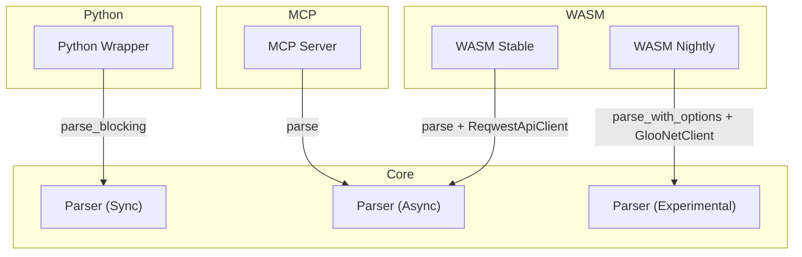

# Wrapper Integration

This document outlines the three integration paths for the core library.

## Integration Paths

## Output Transformations

- **Python**: `ParseResult` → `PyObject`
- **WASM**: `ParseResult` → `JsValue`
- **MCP**: `ParseResult` → `JSON`
